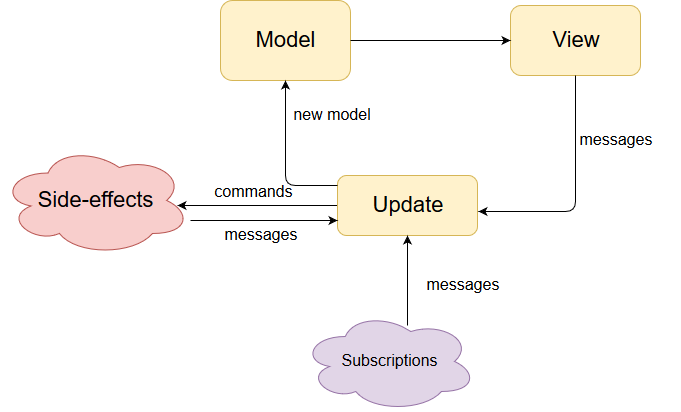

# Estrucutra del código Fuente

El código está separado por módulos dentro del directorio `lib/`, se siguieron las pautas del modelo MVU (Model-View-Update) (tomando algunos conceptos básicos de esta arquitectura):

   

### COMANDO

Realiza una acción asíncrona, como obtener datos de una API o escribir en la base de datos 

### MENSAJE

Describe como debe actualizarse un estado

### MODELO

Describe el estado del programa.

### VISTA

Describe la interface de usuario

### ACTUALIZACION

Actualiza el estado del modelo


El Modelo MVU es una arquitectura bastante simple y directa, se tiene un modelo que se renderiza mediante una vista y la vista llama a los metodos de actualización de estado. Para más detalles se puede consultar el siguiente enlace: 

[Arquitectura MVU Flutter](https://buildflutter.com/functional-model-view-update-architecture-for-flutter/)


Arborescencia de directorios del proyecto:

```
├── android/                            # estructura generada automáticamente por flutter para dispositivos android
├── assets/                             # recursos de la aplicación
|   ├── font/
|   ├── images/
|   └── raw/
├── documentacion/                      # documentación del proyecto
├── ios/                                # estructura generada automáticamente por flutter para dispositivos iOS
├── lib/
|   ├── models/                         # modelos que describen el estado de la aplicación
|   ├── pages/                          # vistas de interface de usuario
|   │   ├── autoregistro/               # vistas del módulo Auto registro
|   |   |   ├── widgets/
|   |   |   |   └── ...
|   |   |   └── ...
|   │   ├── BuscadorTramites/           # vistas del módulo Buscador de trámites gob.bo 
|   │   │   └── ...
|   │   ├── ciudadania_tabs/            # vistas del módulo de notificaciones y servicios de ciudadanía digital
|   |   |   ├── opciones/
|   |   |   |   └── ...
|   |   |   └── ...
|   ├── Inicio/                         # Pagina inicial de la aplicación
|   ├── PreBuzon/                       # vistas del módulo prebuzón
|   |   └── ...
|   ├── styles/                         # Diseños para componentes de UI
|   └── utilidades/                     # capa infraestructura
|       ├── Constantes.dart             # Rutas de consumo por ambiente
|       ├── Services.dart               # Mensajes de actualizacion de estado
|       └── ...
└── test/                               # test de la aplicación
```
 
### lib/models/

En el directorio `models/` se encuentran las clases que guardan el estado actual del sistema.

#### lib/pages

Se definen las vistas del sistema organizadas por los módulos: autoregistro, buscador de trámites, ciudadanía y prebuzón, estas vistas usan los modelos para desplegar la información y pueden actualizar su estado según un mensaje desde Services.dart 

#### Services.dart

Se centralizan las peticiones del sistema y es accesible por todas las vistas que requieren actualizar su estado.

#### tests

Conjunto de test unitarios y test de widgets.  
