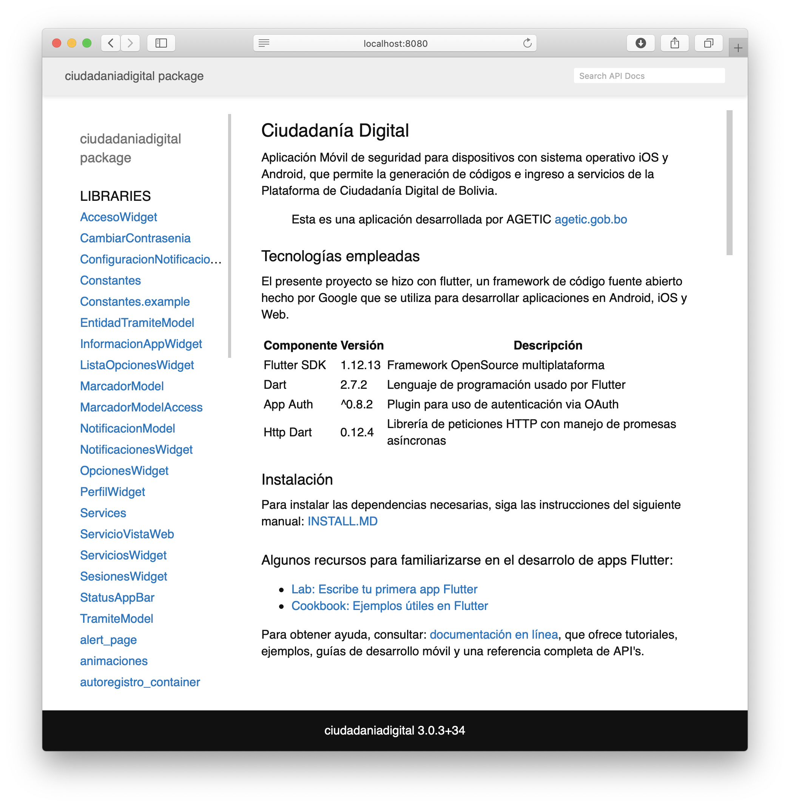

# Manual Técnico

## REQUISITOS

1. Instalar el paquete Dart SDK

```
$ wget https://storage.googleapis.com/dart-archive/channels/stable/release/latest/linux_packages/dart_2.9.3-1_amd64.deb
```

2. Instalar el paquete descargado

```
$ sudo dpkg -i dart_2.9.3-1_amd64.deb
```

3. Agregar dart al PATH del sistema

```
$ export PATH="$PATH:/usr/lib/dart/bin"
``` 


## GENERACION

Para la generación del manual técnico se uso de la herramienta de **dartdoc** 

1. Instalar la dependencia de **dartdoc** en el directorio del proyecto

```
$ pub global activate dartdoc
```

2. Ejecutar el siguiente comando para generar la documentación

```
$ dartdoc
```

**Si se tiene problemas con la generación: ** Ejecutar el comando:
```
$ flutter pub global run dartdoc:dartdoc
```

3. Ejecutar el siguiente comando para activar el servidor de la documentación
```
$ pub global activate dhttpd
```

4. Iniciar el servidor con la documentación 
```
$ dhttpd --path doc/api
```

5. Se podrá observar la siguiente interfaz web para revisar la documentación 

   